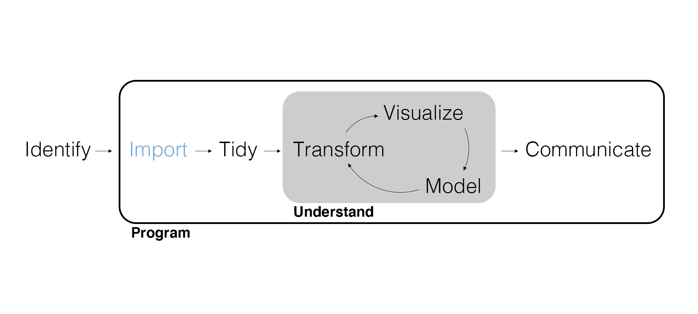
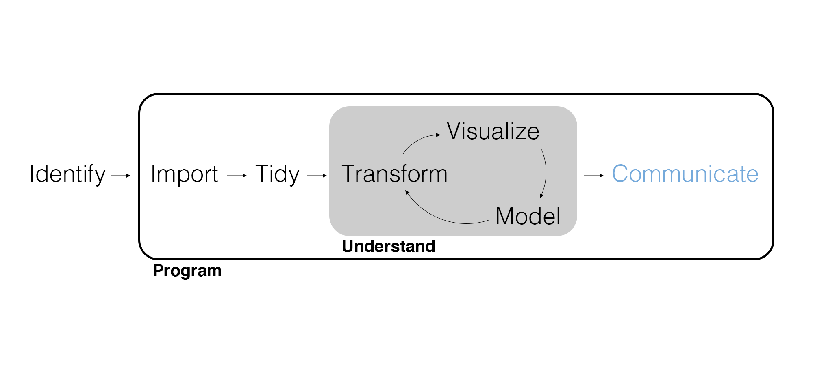
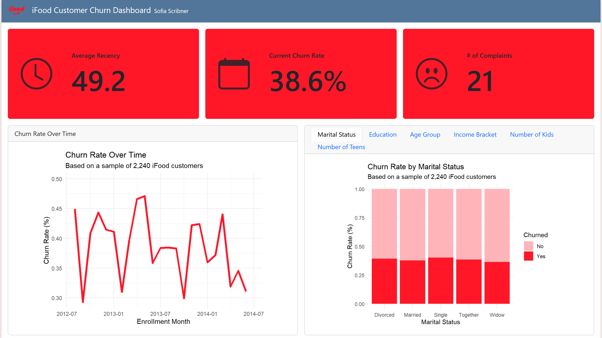
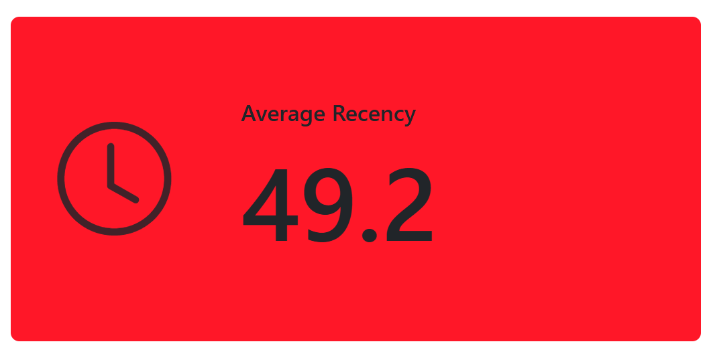
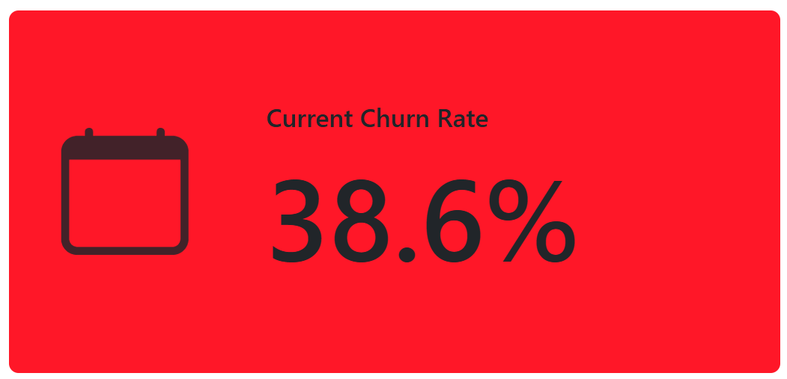
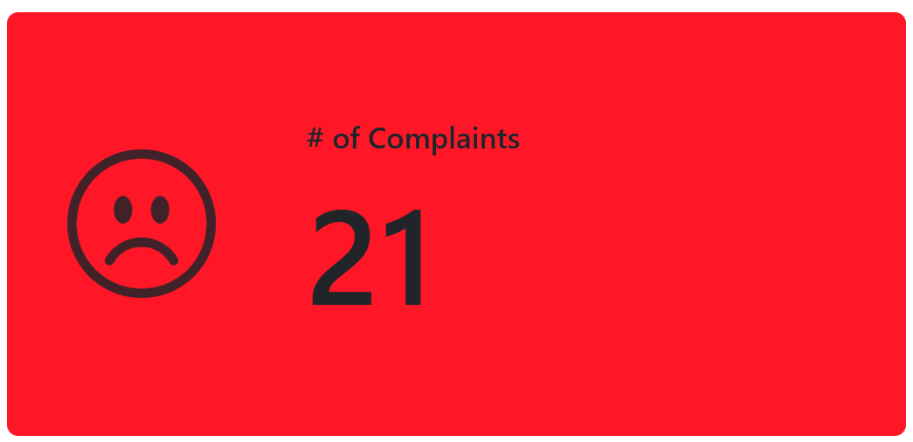
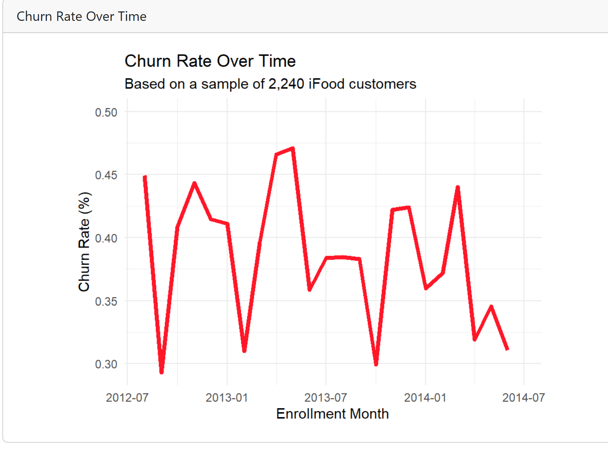

## Marketing Analytics Process

<center>{width="900px"}</center>

## Motivating Example

Now that your supervisor has seen you successfully work with the database and Qualtrics API, she wants you to find some way to display all of these visualizations in a more interactive format. She would like to avoid having to create a long report filled with scatterplots of every single combination of numerical variables, for example. How might this be accomplished?

## Marketing Analytics Process

<center>{width="900px"}</center>

------------------------------------------------------------------------

## Data Products

Remember that an analyst needs to interpret and communicate insights in a way that **clearly informs the managerial decision**. The form that communication takes depends on the audience.

-   Professional visualizations are essential.
-   Reports and presentations provide context, details, and explanations.
-   Dashboards and webapps enable interacting with the data.
-   APIs allow direct access to data, models, and results.

Dashboards, webapps, and APIs are examples of **data products**, ways to share data, models, and results interactively.

## Dashboards

We can use **dashboards** to interactively report on key performance indicators, visualizations, and data exploration. We can build dashboards using Quarto, and then publish them online for stakeholders to view using Quarto Pub.

For your upcoming project, you will be working with a company called iFood. They are an online food ordering and delivery app. Think DoorDash, but in Brazil. They have come to you with some marketing pain points. You will have a chance to explore these using the data they provide you with. Making a dashboard will be an important way to communicate your findings.

## Example Dashboard

For our example here in class, we'll be building [this customer churn dashboard](https://sofiadscribner.quarto.pub/ifood-dashboard/). iFood has some concerns about customer churn, and they're trying to pinpoint what demographics are the most prone to churning, as well as how the churn rate has changed over time. Using data analysis and visualization, we can help them decide how best to prevent some of this churn.

## YAML

```         
---
title: "iFood Customer Churn Dashboard"
author: "Your Name"
format: 
  dashboard:
    logo: ifood.png
---
```

Make sure the logo you want to include is in your working directory!

## Setup

Load packages and import data with *minimal* wrangling (it really should be already-wrangled data).

Note that the data **must be in the same folder as the dashboard .qmd** which is also the *working directory* for the dashboard.

```{r echo=FALSE}

# Load packages and wrangled/cleaned data.

library(tidyverse)
ifood <- read_csv('ifood_cleaned.csv', show_col_types = FALSE)

```

## Final Touches to Data

Because we want the visualizations to be very polished and neat, some final touches may be necessary to ensure the data is ready to go. In this case, we want to make sure that the income levels and education levels are in order from lowest to highest.

```{r}

# Ensure the data is ordered correctly for clean visualizations.

ifood <- ifood |>
  mutate(income_bracket = factor(
    income_bracket, levels = c("0-25K", "25-50K", "50-100K", 
                               "100-200K", "200K+")),
         Education = factor(
           Education, levels = c("High School", "Bachelor's", 
                                 "Master's", "PhD")))

```

## Layout \| Add Rows

You can manage your dashboard layout by adding rows or columns. Imagine these as creating a rough sketch of how you want your dashboard to look, and what goes where.

For this dashboard, we'll use rows. We want three customer churn KPIs (recency, churn rate, and number of complaints) to go across the top, with two larger charts beneath them.

------------------------------------------------------------------------

<center>{width="850px"}</center>

------------------------------------------------------------------------

To start a new row, paste this header into your Quarto document beneath the setup code chunk:

```         
## Row {height=30%}
```

The percentage indicates how much of the vertical space you want the row to take up. Code chunks following the row or column header will show up in that row or column.

## Layout \| Row 1 - Value Boxes

To achieve these clean and simple value boxes, we use this code inside an R code chunk:

```         
#| content: valuebox
#| title: "Average Recency"
#| icon: "clock"
#| color: "#ff1728"
round(mean(ifood$Recency), 1)
```

The title section allows us to include words in the value box. The icon comes from the free section of [Font Awesome](https://fontawesome.com/search?ic=free&o=r). Simply type in the name of an icon and it will appear. The color can be any hex code. The last line is where any calculations for the value should go.

---

<center>{width="850px"}</center>

---

Here is the code for the second value box. The paste0 is just a function that links strings together with 0 spaces.

```
#| content: valuebox
#| title: "Current Churn Rate"
#| icon: "calendar"
#| color: "#ff1728"
paste0(round(mean(ifood$Churned == "Yes") * 100, 1), "%")
```
---

<center>{width="850px"}</center>

## Your Turn!

Can you see if you can figure out how to create the last value box? It should look like this:

<center>{width="850px"}</center>

## Solution

```
#| content: valuebox
#| title: "# of Complaints"
#| icon: "emoji-frown"
#| color: "#ff1728"
sum(ifood$Complain == "Yes")

```

## Layout \| Row 2 - Graphs

For our second row, we want it to take up the remainder of the space so we use

```
## Row {height=70%}
```
First, we want to include a time series chart of the churn rate over time. As you can see, the plot uses our normal ggplot syntax with a similar dashboard heading to what we've seen so far today.

---
```
#| title: Churn Rate Over Time
#| fig-width: 5
#| fig-height: 4
# Churn rate over time
ifood |> 
  mutate(month = floor_date(Dt_Customer, "month")) |> 
  count(month, Churned) |> 
  group_by(month) |> 
  mutate(prop = n / sum(n)) |> 
  filter(Churned == "Yes") |> 
  ggplot(aes(x = month, y = prop)) +
  geom_line(color = '#ff1728', size = 1.5) + 
  scale_x_date(limits = c(min(ifood$Dt_Customer), max(ifood$Dt_Customer))) +
  labs(
    title = "Churn Rate Over Time",
    x = 'Enrollment Month',
    y = 'Churn Rate (%)',
    subtitle = 'Based on a sample of 2,240 iFood customers'
  ) +
  theme_minimal()

```
---

<center>{width="850px"}</center>

---

Remember, for your project you will be doing this work. Cleaning and prepping the data, making calculations, and figuring out the best way to visualize it.

## Layout \| Row 2 - Tabs

We have a lot of different demographics we want to look at. Age, income, marital status, education, and others. One way to display these without creating an overly long report is by using tabs that the viewer can switch between. Add this heading before the next code chunks:

```
### Column {.tabset}
```
---

The rest of the code is included in your starter code. It contains all the different versions of the stacked bar chart, but for each demographic.


## Publishing Your Dashboard

The easiest way to publish this Quarto dashboard for others to see is through Quarto Pub. Go to your terminal and type this command, replacing the document name with the one you've chosen:

```
quarto publish quarto-pub document.qmd
```
---

Watch the prompts as they pop up in the terminal. If you haven’t published to Quarto Pub before, the publish command will prompt you to authenticate, which will require creating an account. It's easiest to just sign up with Google. After confirming that you want to publish, your content will be rendered and deployed, and then a browser opens to view your site.


## Live Coding Exercise

What are some ways we could improve this dashboard? What kind of visualizations would you like to see?

## Wrapping Up

*Summary*

-   Discussed communicating marketing insights with your audience in mind.
-   Walked through creating a dashboard with Quarto

*Next Time*

-   Our first project week!

## Exercise 7

In RStudio, do the following in *two* documents.

1.  In a Quarto document with `format: docx`, wrangle the customer data to include the total amount spent in-store for each customer. Write this data as a CSV file *in the Exercises folder*.
2.  In an R Markdown document, modify the dashboard from class by importing the new data, adding a second input function to the sidebar to select from `college_degree`, modifying the plot to filter on both input functions, replacing age with total amount spent in-store in the plot, and modifying the call-out boxes to filter on both input functions.
3.  Knit the R Markdown document and publish it on shinyapps.io. Include the link at the end of the Quarto document (add a link with `[text](URL)`), rendered as a Word document, and upload to Canvas.
